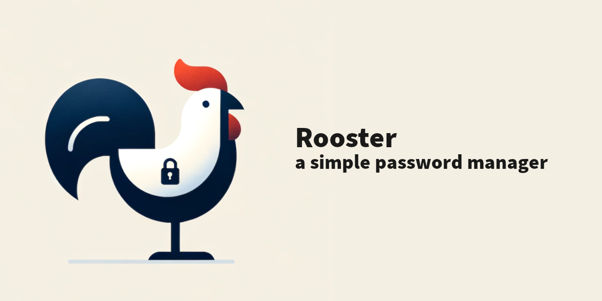

# Rooster

Rooster is a simple password manager. It helps you save username/password combinations 
through a friendly command-line interface. Rooster runs on Windows, MacOS and Linux.



Rooster is made available free of charge. You can support its development through [Liberapay](https://liberapay.com/conradkleinespel/) 💪

## Features

Rooster has the following goals:

- it is easy to maintain so that it **never becomes unmaintained**, it has existed since 2015;
- it **works completely offline** by saving your password in a single local file;
- it stores **username/password combinations, nothing more, nothing less**;
- it can **import/export** passwords from and to 1Password/JSON/CSV;
- it can run on a **wide range of operating systems**.

Rooster protects your passwords with state-of-the-art cryptography algorithms:

- scrypt for key derivation (`n = 2^12, r = 8, p = 1` by default, customizable)
- aes-256-cbc for encryption
- hmac-sha512 for authentication

## Installation

To install Rooster, run the following commands as `root`.

On **Arch Linux**, install [Rooster from AUR](https://aur.archlinux.org/packages/rooster).

On **Void Linux**, install [Rooster from XBPS](https://github.com/void-linux/void-packages/blob/master/srcpkgs/rooster/template).

On **Fedora** and **CentOS**:

```shell
dnf update -y
dnf install -y curl gcc unzip pkgconfig libX11-devel libXmu-devel python3
curl https://sh.rustup.rs -sSf | sh -s -- -y
source $HOME/.cargo/env
cargo install --all-features --root /usr rooster
```

On **Debian**:

```shell
apt-get update -y
apt-get install -y curl gcc unzip pkg-config libxcb-render0-dev libxcb-shape0-dev libxcb-xfixes0-dev libx11-dev libxmu-dev python3 libssl-dev xsel
curl https://sh.rustup.rs -sSf | sh -s -- -y
source $HOME/.cargo/env
cargo install --all-features --root /usr rooster
```

On **Ubuntu 16.04/18.04**:

```shell
apt update -y
apt install -y curl unzip pkg-config libxcb-render0-dev libxcb-shape0-dev libxcb-xfixes0-dev libx11-dev libxmu-dev python3 libssl-dev xsel
curl https://sh.rustup.rs -sSf | sh -s -- -y
source $HOME/.cargo/env
cargo install --all-features --root /usr rooster
```

On **MacOS**:

```shell
brew install curl
curl https://sh.rustup.rs -sSf | sh -s -- -y
cargo install --all-features rooster
```

On **Windows**, [install Rust](https://www.rust-lang.org/tools/install) and then run:
```shell
cargo install --all-features rooster
```

If you use **Wayland** instead of X11, install [wl-clipboard](https://github.com/bugaevc/wl-clipboard) and make sure you have the following
environment variable set: `XDG_SESSION_TYPE=wayland`.

For other distributions, the various Docker files can help you find which dependencies you need.

## Usage

Once you have installed Rooster, create a new password file:

```shell
rooster init
```

Once setup is finished, see `rooster --help` for what you can do.

## License

The source code is released under the Apache 2.0 license.
